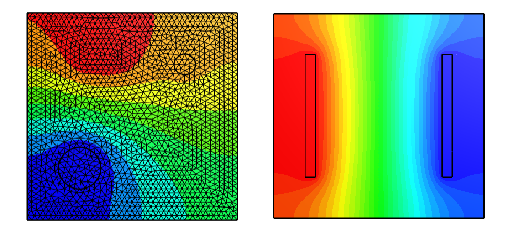
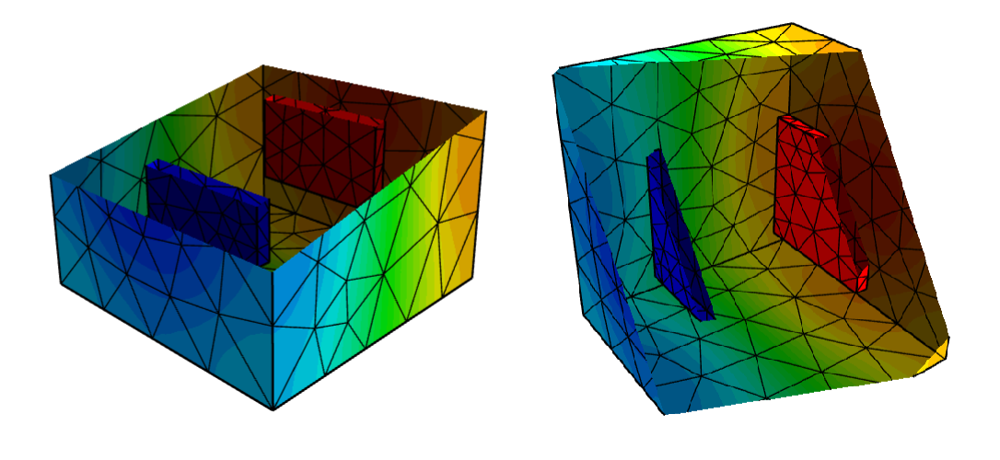

# PINNs-EIT

A Python package to create the FEM model and the required boundary and surface/volume collocation points for training a PINN.

## Preview

Two-dimensional forward model wrapped to `ngsolve`.

Three-dimensional forward model wrapped to `ngsolve`.
